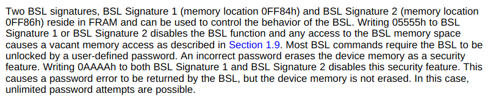
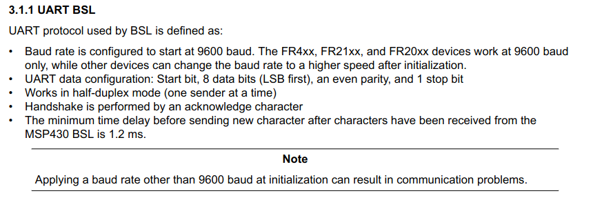
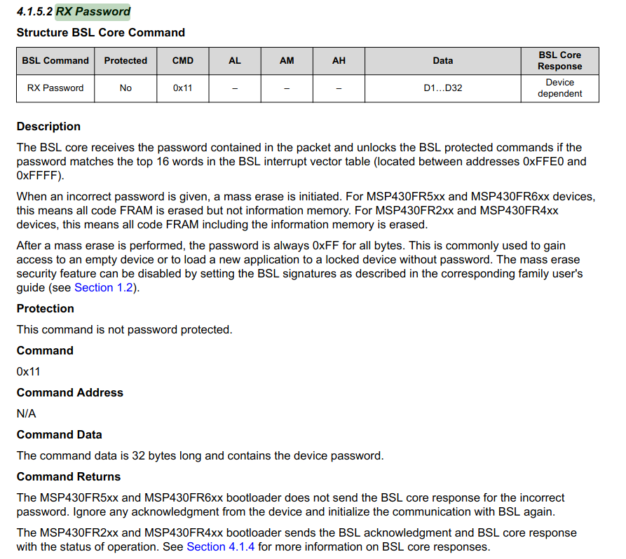
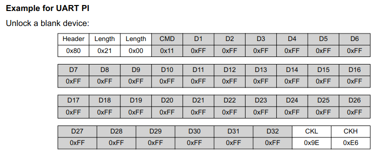

# MSP430 BSL

## References

MSP430FR5969 Product Details - https://www.ti.com/product/MSP430FR5969  
Device Overview - https://www.ti.com/lit/ds/symlink/msp430fr5969.pdf  
User's Guide - https://www.ti.com/lit/ug/slau367p/slau367p.pdf?ts=1738313537365  
MSP430 BSL Guide - https://www.ti.com/lit/ug/slau550ab/slau550ab.pdf?ts=1737654439177  


## Definitions/Acronyms

BSL - **B**oot**S**trap **L**oader

## Unlocking Bootloader Commands

Before an application can command the bootloader, it must first unlock the bootloader by 
supplying a password.

### Disabling Mass Erase

By default, sending the incorrect password will cause the device to
perform a mass erase of RAM.

This security feature can be disabled:



In code, this can be done with the following:

```c++
#define BSL_SIG_1 (0x0FF84)
#define BSL_SIG_2 (0x0FF86)

void disable_incorrect_password_mass_erase() {
  uint16_t* ptr = BSL_SIG_1;
  (*ptr) = 0x0AAAA;

  ptr = BSL_SIG_2;
  (*ptr) = 0x0AAAA;
}
```

### Sending the Password

The BSL of the MSP430 can be accessed by communicating with it via the 
corresponding UART pins.



The application code sends the command by using the following format.



Example command to unlock the Bootloader:

